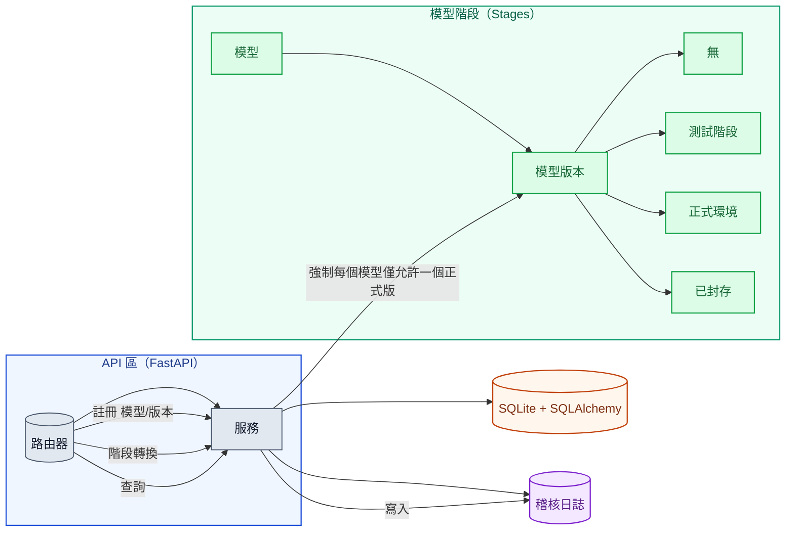

# Day22 — Model Registry（模型版本與週期管理）Demo

一個極簡、可直接跑的 **Model Registry**：

- 追蹤 **Model ➜ Version ➜ Stage**（`None / Staging / Production / Archived`）
- 強制 **每個 Model 只能有一個 Production 版本**
- 支援 **Promote / Rollback / Archive / Tags / Metadata / Artifact URL**
- 內建 **審計日誌（Audit log）** 與 **簡易情境測試（pytest）**

> Tech stack：FastAPI、SQLite（SQLAlchemy）、Uvicorn、Pytest

## 📁 專案結構

```
day22_model_registry/
├── README.md                       — 專案說明、啟動方式、API 清單、情境操作（A/B、回滾等）
├── app
│   ├── db.py                       — DB 初始化與連線：讀 DATABASE_URL、建 engine/session、init_db/get_session
│   ├── main.py                     — FastAPI 路由：/healthz、/models、/versions、/transition、/production、/audit
│   ├── models.py                   — ORM 與資料表：Stage Enum、Model、ModelVersion（唯一約束）、Audit
│   ├── schemas.py                  — Pydantic 請求/回應模型
│   ├── services.py                 — 商業邏輯：建立/查詢、流轉（含「單一 Production」強制）、稽核
│   └── utils.py                    — 輔助：字串↔Enum 轉換、合法流轉檢查
├── docker-compose.yml              —（選用）Docker 本地啟動；需要同目錄 Dockerfile 才能 build
├── environment.yml                 — Conda 環境（FastAPI/SQLAlchemy/Uvicorn/Pytest…）
├── pytest.ini                      — pytest 設定（asyncio）
├── registry.db                     — SQLite 本地資料檔（可持久化；建議加入 .gitignore）
└── tests
    ├── test_happy_path.py          — 情境測試：註冊→v1 上線→建立 v2→A/B→回滾→封存
    └── test_rules.py               — 規則測試：非法轉換與「唯一 Production」
```

## 🧭 架構圖（Mermaid）



## ▶️ 快速開始

### 1) 使用 Conda（建議）

```bash
conda env create -f environment.yml
conda activate day22_model_registry

# （可選）固定 SQLite 路徑，避免不同工作目錄/權限問題，預設 DATABASE_URL = "sqlite:///./registry.db"
mkdir -p data
export DATABASE_URL="sqlite:///$PWD/data/registry.db"

uvicorn app.main:app --reload --port 8000
```

啟動後瀏覽：

- OpenAPI Docs: `http://localhost:8000/docs`
- 健康檢查：`GET /healthz`

> SQLite 持久化：只要 DATABASE_URL 指到檔案（如 data/registry.db），應用關掉後資料仍會保存；若用 :memory: 則不會。
>
> 想要「一次性／不留資料」的測試，可改用純記憶體 DB（不會持久化）：
>
> 重啟應用、程式崩潰、或 --reload 重新載入時，資料都會清空
>
> export DATABASE_URL="sqlite:///:memory:"

## 🔌 REST 介面（精選）

- `POST /models`：新增模型
- `GET  /models`：列出所有模型
- `POST /models/{name}/versions`：為模型建立新版本（預設 stage="None"）
- `GET  /models/{name}/versions`：列出版本
- `POST /models/{name}/versions/{version}/transition`：階段轉換 （`None→Staging→Production→Archived`、支援 `rollback_to`）
- `GET  /models/{name}/production`：查詢目前 `Production` 版本
- `GET  /audit`：查詢審計日誌

#### 規則

- 同一時間 同一模型僅允許一個 `Production`（Promote 新版本時，舊 `Production` 會自動降為 `Staging`）。
- `Archived` 不可再 Promote。
- 允許 `Production` → `Staging`（回滾準備）或 `Production` → `Archived`。
- 同狀態轉換（如 `Production`→`Production`）為 no-op 或被拒（依此版本；若為 no-op 會寫一筆 audit）。

## 🧪 情境測試（Scenario）

> 小提醒：若遇到 `attempt to write a readonly database`，請確認 `DATABASE_URL` 指向你有寫入權限的位置（例如 sqlite:///$PWD/data/registry.db），並確保該資料夾存在與可寫入。

### 情境 A：正常上線與回滾

1. 註冊 `faq-bot` 模型。

```bash
curl -sX POST localhost:8000/models -H 'Content-Type: application/json' \
  -d '{"name":"faq-bot","owner":"hazel","description":"Q&A bot"}' | jq
```

2. 建立 `v1.0.0`（預設 None → Promote 至 Staging → Production）

```bash
# 建立 v1.0.0（預設 stage = "None"）
curl -sX POST localhost:8000/models/faq-bot/versions -H 'Content-Type: application/json' \
  -d '{"version":"1.0.0","artifact_url":"s3://bucket/faq-bot/1.0.0","tags":["baseline"],"meta":{"commit":"a1b2c3"}}' | jq

# None → Staging
curl -sX POST localhost:8000/models/faq-bot/versions/1.0.0/transition \
  -H 'Content-Type: application/json' -d '{"to_stage":"Staging","actor":"hazel"}' | jq

# Staging → Production
curl -sX POST localhost:8000/models/faq-bot/versions/1.0.0/transition \
  -H 'Content-Type: application/json' -d '{"to_stage":"Production","actor":"hazel"}' | jq

# 檢查全部版本狀態
curl -s localhost:8000/models/faq-bot/versions | jq
```

3. 新建 `v1.1.0`（預設 None → 升到 Staging），模擬準備要進行 A/B 測試

```bash
# 建立 v1.1.0（預設 None）
curl -sX POST localhost:8000/models/faq-bot/versions -H 'Content-Type: application/json' \
  -d '{"version":"1.1.0","artifact_url":"s3://bucket/faq-bot/1.1.0","tags":["canary"],"meta":{"commit":"d4e5f6"}}' | jq

# None → Staging（開始 A/B）
curl -sX POST localhost:8000/models/faq-bot/versions/1.1.0/transition \
  -H 'Content-Type: application/json' -d '{"to_stage":"Staging","actor":"hazel"}' | jq
```

4. 假設 A/B 測試完畢而且 `v1.1.0` KPI 下降，`Production` 環境回滾到 `v1.0.0`，把 `v1.0.0` 設為 `Production`，並加上 `rollback_to: true`

```bash
curl -sX POST localhost:8000/models/faq-bot/versions/1.0.0/transition \
  -H 'Content-Type: application/json' -d '{"to_stage":"Production","actor":"hazel","rollback_to":true}' | jq
```

5. 將 `v1.1.0` 封存 `Archived`。

```bash
curl -sX POST localhost:8000/models/faq-bot/versions/1.1.0/transition \
  -H 'Content-Type: application/json' -d '{"to_stage":"Archived","actor":"hazel"}' | jq
```

### 情境 B：強制 Production 唯一性

- 當 `v1.0.0` 已在 Production，將 `v1.1.0` Promote 至 Production 時，系統會自動把 `v1.0.0` 降級為 `Staging`（或拒絕，依規則設定）。此 Demo 採 **自動降級** 策略，確保零手動衝突。

```bash
curl -sX POST localhost:8000/models/faq-bot/versions/1.1.0/transition \
  -H 'Content-Type: application/json' -d '{"to_stage":"Production","actor":"hazel"}' | jq
```

### 情境 C：非法轉換防護

> 前置：若尚未封存 v1.1.0，請先執行封存指令再測以下情境。

- 先建立 v2.0.0

```bash
curl -sX POST localhost:8000/models/faq-bot/versions -H 'Content-Type: application/json' \
  -d '{"version":"2.0.0","artifact_url":"s3://bucket/faq-bot/2.0.0"}' | jq
```

- 嘗試將 Archived 版本 Promote (`Archived → Staging/Production`)：拒絕

```bash
curl -sX POST localhost:8000/models/faq-bot/versions/1.1.0/transition \
  -H 'Content-Type: application/json' -d '{"to_stage":"Production","actor":"hazel"}' | jq
```

- 嘗試跳階（例如從 `None` 直接到 `Production`）：拒絕

```bash
curl -sX POST localhost:8000/models/faq-bot/versions/2.0.0/transition \
  -H 'Content-Type: application/json' -d '{"to_stage":"Production","actor":"hazel"}' | jq
```

所有情境已以 **pytest** 覆蓋於 `tests/`。

## 其他操作

```bash
# 1) 查詢現在 production 的版本
curl -s localhost:8000/models/faq-bot/production | jq

# 2) 顯示 audit log
curl -s localhost:8000/audit | jq
```

## API/整合測試

```bash
# 執行
pytest -q
# 或
pytest -vv
```

## 🧰 實務備註（可延伸）

- **Stage Gate 策略**：Production 前要求必備度量（如線上 CTR、錯誤率、質檢分數）。
- **多環境（Dev/Staging/Prod）** 對映 **多租戶 Registry** 或 `env` 欄位。
- **與 CI/CD 整合**：PR 合併或 Release Tag 觸發 `create_version`；部署完畢再 `transition`。
- **與觀測平台整合**：將度量寫入 meta，於 Promote 前自動驗證 SLO。
- **存放 Artifact**：S3/MinIO，支援 Checksum 與簽章。

## ✅ 你可以直接做什麼？

1. 直接跑起來，用 `curl` 清單把 **v1 上線、v2 金絲雀、回滾** 全部走一遍。
2. 嘗試把 **Production 唯一性策略** 改成「禁止、需手動降級」。
3. 在 `meta` 塞入你的評估指標（e.g., `eval_f1`, `traffic_share`），並在 Promote 前自動檢查。
